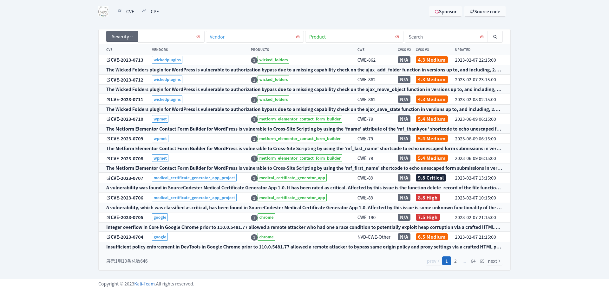

# nvd-rs
---
- A collection of lib for working with [National Vulnerability Database](https://nvd.nist.gov/).

## CVE

## Details

## Libraries

### cvss 通用漏洞评分系统
- [doc](https://emo-crab.github.io/nvd-rs/cvss/)

### cve 通用漏洞披露
- [doc](https://emo-crab.github.io/nvd-rs/cve/)

### cpe 通用平台枚举
- [doc](https://emo-crab.github.io/nvd-rs/cpe/)

### cwe 通用弱点枚举
- [doc](https://emo-crab.github.io/nvd-rs/cwe/)