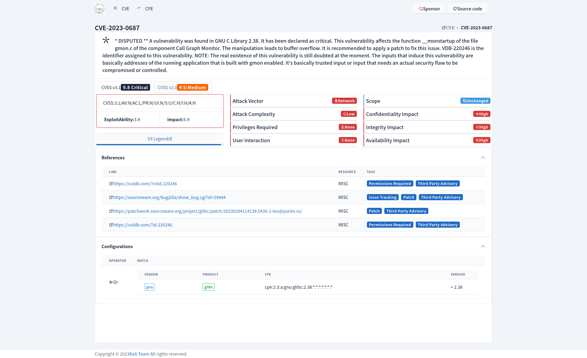

# scap-rs
---

- A collection of lib for working with [National Vulnerability Database](https://nvd.nist.gov/).

## Libraries

### cvss 通用漏洞评分系统

[![github]](https://github.com/emo-crab/scap-rs)&ensp;[![crates-io]](https://crates.io/crates/nvd-cvss)
&ensp;[![docs-rs]](crate)

[github]: https://img.shields.io/badge/github-8da0cb?style=for-the-badge&labelColor=555555&logo=github

[crates-io]: https://img.shields.io/badge/crates.io-fc8d62?style=for-the-badge&labelColor=555555&logo=rust

[docs-rs]: https://img.shields.io/badge/docs.rs-66c2a5?style=for-the-badge&labelColor=555555&logo=docs.rs

### cve 通用漏洞披露

[![github]](https://github.com/emo-crab/scap-rs)&ensp;[![crates-io]](https://crates.io/crates/nvd-cves)
&ensp;[![docs-rs]](crate)

[github]: https://img.shields.io/badge/github-8da0cb?style=for-the-badge&labelColor=555555&logo=github

[crates-io]: https://img.shields.io/badge/crates.io-fc8d62?style=for-the-badge&labelColor=555555&logo=rust

[docs-rs]: https://img.shields.io/badge/docs.rs-66c2a5?style=for-the-badge&labelColor=555555&logo=docs.rs

### cpe 通用平台枚举

[![github]](https://github.com/emo-crab/scap-rs)&ensp;[![crates-io]](https://crates.io/crates/nvd-cpe)
&ensp;[![docs-rs]](crate)

[github]: https://img.shields.io/badge/github-8da0cb?style=for-the-badge&labelColor=555555&logo=github

[crates-io]: https://img.shields.io/badge/crates.io-fc8d62?style=for-the-badge&labelColor=555555&logo=rust

[docs-rs]: https://img.shields.io/badge/docs.rs-66c2a5?style=for-the-badge&labelColor=555555&logo=docs.rs

### cwe 通用弱点枚举

[![github]](https://github.com/emo-crab/scap-rs)&ensp;[![crates-io]](https://crates.io/crates/nvd-cwe)
&ensp;[![docs-rs]](crate)

[github]: https://img.shields.io/badge/github-8da0cb?style=for-the-badge&labelColor=555555&logo=github

[crates-io]: https://img.shields.io/badge/crates.io-fc8d62?style=for-the-badge&labelColor=555555&logo=rust

[docs-rs]: https://img.shields.io/badge/docs.rs-66c2a5?style=for-the-badge&labelColor=555555&logo=docs.rs

## CVE

## Details

## Exploit

