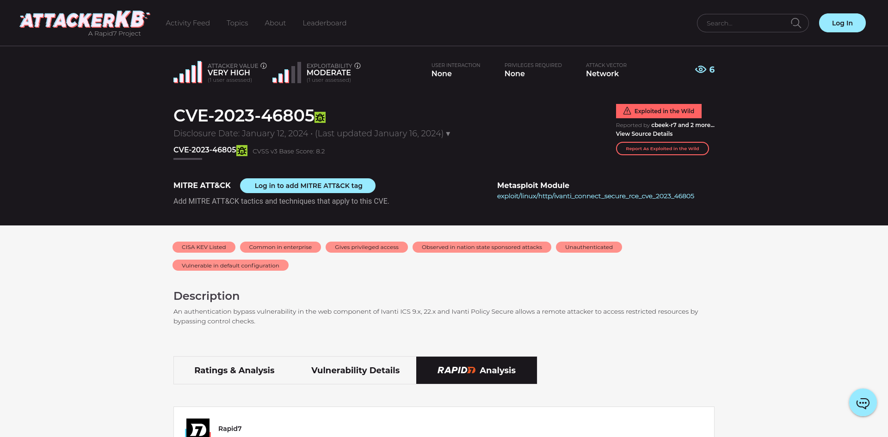

# Mark CVE
---
[![github]](https://github.com/emo-crab/scap-rs/tree/main/extensions)

[github]: https://img.shields.io/badge/github-8da0cb?style=for-the-badge&labelColor=555555&logo=github

- Mark the current page CVE.

## Using

- Install the plugin, open a webpage with a CVE number, click on the plugin, and you will see a button added after the CVE.

